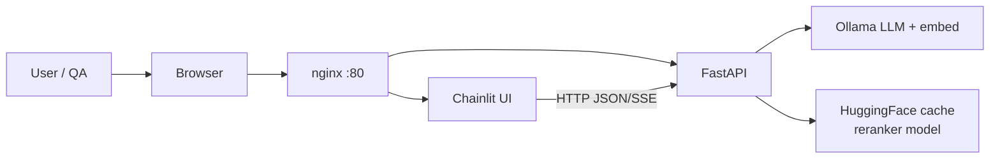
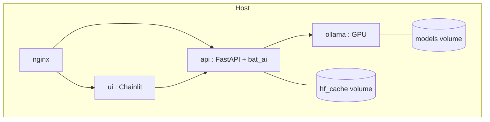
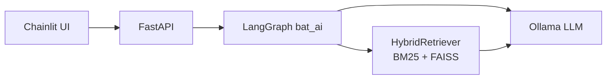
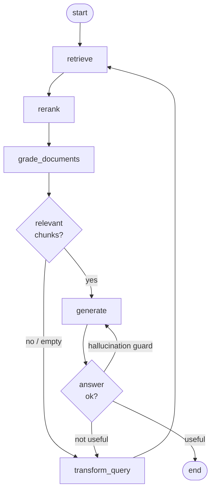
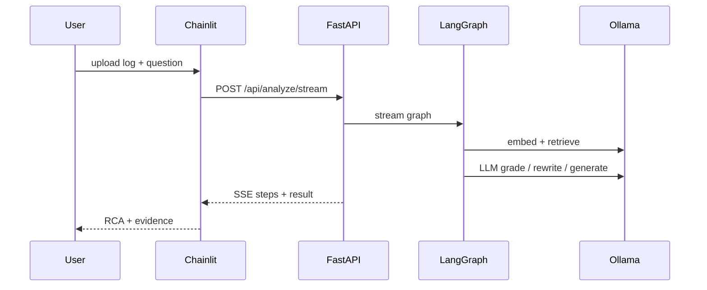
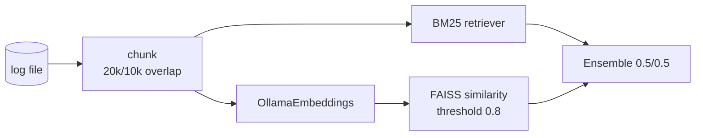

# Log-RCA — draft (presentation)

> Minimal text; diagrams carry the story.

## 1. System context

## 2. Containers (Docker)

## 3. Components — role

| Piece | Role |
|-------|------|
| **nginx** | Reverse proxy; `/` → UI, `/api` → API |
| **Chainlit UI** | Upload log, chat, SSE progress |
| **FastAPI** | Streams LangGraph pipeline events |
| **bat_ai** | Compiled **LangGraph** state machine |
| **Ollama** | LLM inference + embedding models |
| **HybridRetriever** | BM25 + FAISS over log chunks |
| **FlagReranker** | Cross-encoder rerank (HF) |

## 4. LangGraph pipeline (RAG + self-correction)

## 5. End-to-end (happy path)

## 6. Retrieve internals

